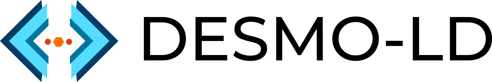

The DESMO-LD project aims to provide a fully integrated distributed solution for consuming IoT external data, enriched with Web of Things semantics and data model, inside the ONTOCHAIN. This addresses the ONTOCHAIN call's objectives of designing new trustful decentralized Oracles to poll semantic data from off-chain data sources. Besides, DESMO-LD introduces novel strategies to solve the known interoperability problems thanks to the heavy deployment of standard ontology and semantic oriented consensus algorithms for data quality and trustiness.

# Architecture
DESMO-LD is a Decentralized Oracle for IoT data powered by WoT technologies. The system architecture is divided between an on-chain part, consisting of a set of smart contracts, and an off-chain part with the Oracle DApp and the Web of Things Thing Description Directory (TDD). The project structure is consequently organized as follows:
- [Smart Contracts](https://github.com/vaimee/desmo-contracts/blob/55cf7b0dec88ca211250b0a95a67a6bcffad89ee/README.md)
- [Oracle DApp](https://github.com/vaimee/desmo-dapp/blob/bea690443eb16dbc563f6c0c5d3f391d8587038a/README.md)
- [TDD](./zion/README.md)

For an overview of the system architecture, please refer to the [architecture diagram](./imgs/architecture.jpg).

The system allows client Smart Contracts and DApps to access off-chain data produced by a network of IoT devices. The solution enables the development of different applications according to the vertical implementation of any horizontal features developed. The value generated by the token transactions is enhanced through the development of a “pay-per-request” subscription service to access the resources. Throughout the process to retrieve information all the actors involved will be rewarded with tokens.

**On-Chain: Decentralized iExecDoracle**
The on-chain part is strictly connected to the development of a decentralized network of Oracles. The value of the Decentralized Oracle lies in the trustfulness of the data provided on-chain which increases the level of security and fairness of Smart Contracts. Data and process management in cross-sectors environments mostly benefit from a Smart Contract built upon Decentralized Oracles because they can enhance the intrinsic value of getting access to multiple and heterogeneous data sources that are reliable.

**Off-Chain: WoT Decentralized Data Sources**
The off-chain part is linked to the [Web of Thing]( https://www.w3.org/WoT/) functionality and technologies. Value is created by accessing a constant real-time stream of quality IoT data from the WoT. Moreover, it features a ranking system able to assess data sources' quality to de-incentives bad or unfair behaviour. Data streamed are organized and defined in [Thing Description](https://www.w3.org/TR/2020/REC-wot-thing-description-20200409/) which manifest the interactions affordances among IoT devices or services. The generated value is enhanced through the automatic rewarding of the possessors of WTs devices that the architecture guarantee.

# Main Innovation
The DESMO-LD project will focus on a trusted decentralized oracle system to reliably
consume IoT data from on-chain Smart Contracts. The main innovation points consists:
- Leverage on [WoT interaction model](https://www.w3.org/TR/2020/REC-wot-architecture-20200409/) and [WoT ontology](https://www.w3.org/2019/wot/td) for implementing an
interoperable connection layer with heterogeneous IoT systems and devices;
- Provide trustable means to induce real world effects thanks to attenuation APIs;
- Native support for geolocation queries and data.

### Acknowledgements
This project has received funding from the European Union’s Horizon 2020 research and innovation program through the NGI ONTOCHAIN program under cascade funding agreement No 957338

<a href="https://ontochain.ngi.eu/">
</img>
</a>
