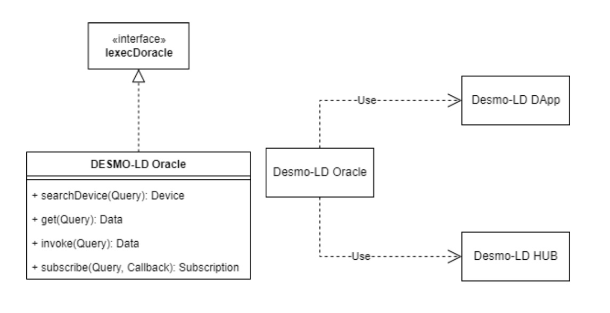
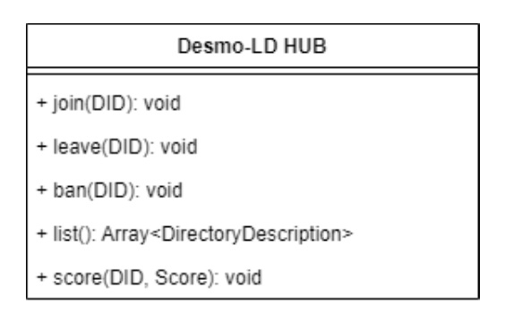

# Smart Contracts

# Desmo-LD iExecDoracle

The Desmo-LD iExecDOracle is a smart contract that implements the IExec INTERFACE_NAME. Its purpose is to serve as the main API entrypoint for client Smart Contracts. Additionally, to the IExec API, the DESMO-LD iExecDOracle will implement the logic to randomly select a set of valid Thing Description Directories registered in the DESMO-LD Hub. The APIs will serve on-chain clients with endpoints that can search for a device inside the DESMO-LD network of Thing Description Directories, get sensor data, invoke operations on remote sensors and finally subscribe to events.

# DESMO-LD HUB

The DESMO-LD HUB is a registry of Thing Description Directories that can be queried using the Desmo-LD iExecDOracle. It is a smart contract deployed on-chain with the main purpose of having an immutable list of Thing Description Directories registered in the system. Moreover, it contains the reputation scores of each registered service together with their Thing Description.

