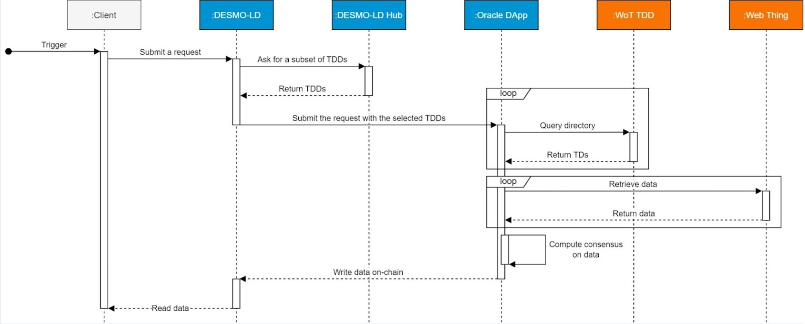

# Solution Description and Functionalities

DESMO-LD is a Decentralized Oracle system for W3C compliant Web Things. It is built on top of the iExec decentralized cloud computing platform, fully integrated with iExec RLC token economy. The following will describe the main software architecture and the data flow, with details on how the participants buy and sell their services. 

The system architecture is divided between an on-chain part, consisting of a set of smart contracts, and an off-chain part with the Oracle DApp and the Web of Things Thing Description Directory (TDD).

# Architecture

.

Starting from the left on the architectural diagram, we can see different types of clients that may be interested in using the system: a classic smart contract, a complete full-stack DApp, or even a pure web3 frontend application. 
The elements in blue are those developed and deployed directly by VAIMEE:
1. DESMO-LD contract; on-chain oracle API
2. DESMO-LD Hub contract; the registry of TDDs in the system
3. Oracle DApp; distributed iExec oracle application to retrieve IoT data off-chain
The elements in orange are those developed by VAIMEE, but deployed and controlled by third-parties:
WoT TDD; a registry for WT TDs that support CRUD operations and events.

In Figure at the end of the page, we can see what happens when a client demands new data from the system.
1. The DESMO-LD contract gets a set of registered TDDs from the DESMO-LD Hub contract and adds them to the current request. 
2. The entire payload is collected by the Oracle DApp which takes over the request and begins its processing. 
    1. The DApp prepares the query and sends it to each selected TDD.
    2. It uses the retrieved TDs to consume the WTs and read their data.
    3. Through a consensus process with the other replicas it identifies the final value of the operation. 
    4. The DApp will write the result on the chain making the information available to the client/s.

Regarding the token economics we can identify four players:
1. TDD owners; may decide to join the network to earn tokens each time they are selected by the protocol to fulfil a request. Their job will be to maintain a curated repository of WTs to provide high-quality data to the network. Their reward will be proportional to the number of WTs found that provide meaningful results. To avoid an excessive proliferation of poor quality (or fraudulent) TDDs, the system requires an initial stake of tokens as a sign of “good faith”, after which, the node will become part of the network
2. iExec platform; part of the tokens will be used to pay the iExec computation fees to power the Oracle DApp.
3. VAIMEE; from each request, a micro percentage of tokens will be extracted and used by VAIMEE to maintain the various open-source software that are part of the project and, at the same time, earn something from their use.
4. Clients; before performing a request, they must make sure they have deposited (allowance) enough tokens on the DESMO-LD address. The protocol will use them to reward the various actors and make the work of the entire network sustainable.

.

# Component specification

In the current software architecture design the components that will be developed and owned by VAIMEE s.r.l are:

1. DESMO-LD iExecDOracle
2. DESMO-LD Hub
3. Oracle DApp

Whereas the component that will be developed but it will be open to third parties contributions is: 
Thing Description Directory

# High-level software quality analysis

An agile software development approach will be followed, implementing a CI/CD workflow based on integration and unit tests.
The quality of the DESMO-LD software ecosystem will be analyzed according to the following set of KPIs. 
1. Reliability
    1. Test code coverage
2. Scalability
    1. Time to resolve a query for TDs
    2. Time to resolve a query for IoT data
    3. Number of WoT TDD nodes
    4. Maximum number of TD handled by one TDD
3. Security
    1. Authentication and authorization mechanisms
4. Maintainability
    1. Architecture quality analysis
        1. Number of dependencies with external libraries
        2. Final package size
        3. Other code KPIs:
            1. Average Component Dependency
            2. Size of Biggest Cycle Group
    2. Qualitative documentation analysis

# Components Specification

In the next sections, there is a high-level description of each component of the architecture, before continue remember the general schema of the architecture and how these components are connected. In general, a request for IoT data is performed using the front-end which will check and finalize it, and then the request will forward to the DESMO-LD Contract. The DESMO-LD Contract will use the DESMO-LD Hub to retrieve access to the Directories. The IoT query is resolved and the result is obtained from the DESMO-LD DApp, which will query the Directories specified in the Contract. Finally, the result is backward and saved in the blockchain.

Continue to the components.