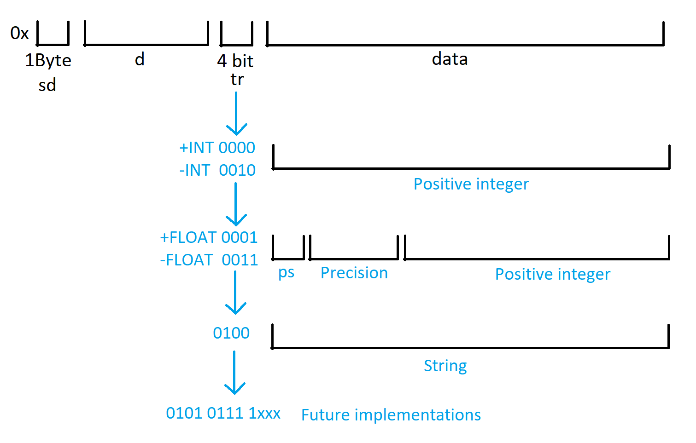

# Encoding

The encoding is used to build a string hex which will contain the result of the query and the list with the reward/punishment of the Directories
We have 3 types of encoding-decoding:

# Algorithm based on a manual encoding

The following schema represent an hex string, where

1. **sd** is the size of the directories payload that can be found at (1,sd+1) char of the hex string (**d**).
2. **d** is the hex string that contains the reward/punishment of the Directories. Each hex char will contain 4 Directory scores (Max directories: 256*4=1024).
3. **tr** is the Type of the result stored in the **data** part of the hex string, for example, '0100' is a string result.
4. **ps** is the size of the hex char used to represent **precision**.
5. **precision** is an integer that represents the precision of the floating-point of the number.

Example: 

`0x029589025110f013`

`0x028985400700072006f007600610020007100750065007300740061002000e800200075006e006100200073007400720069006e00670061`

# Algorithm based on ABI

WIP

# Algorithm that is a mix of manual encoding and ABI

It uses the ABI encoder to encode the result and the manual encoder to encode the type of the result and the Directory reward/punishment.
At first chars there is the encoded results from ABI. Then there is the size of the directories list, then there are the directories followed by the type of the result. 

Example: 

`0x000000000000000000000000000000000000000000000000000000000145aea8000000000000000000000000000000000000000000000000000000000000000285010201`

where 

`0x000000000000000000000000000000000000000000000000000000000145aea80000000000000000000000000000000000000000000000000000000000000002`

is the ABI encoded result and `85010201` the manual ecoded part.