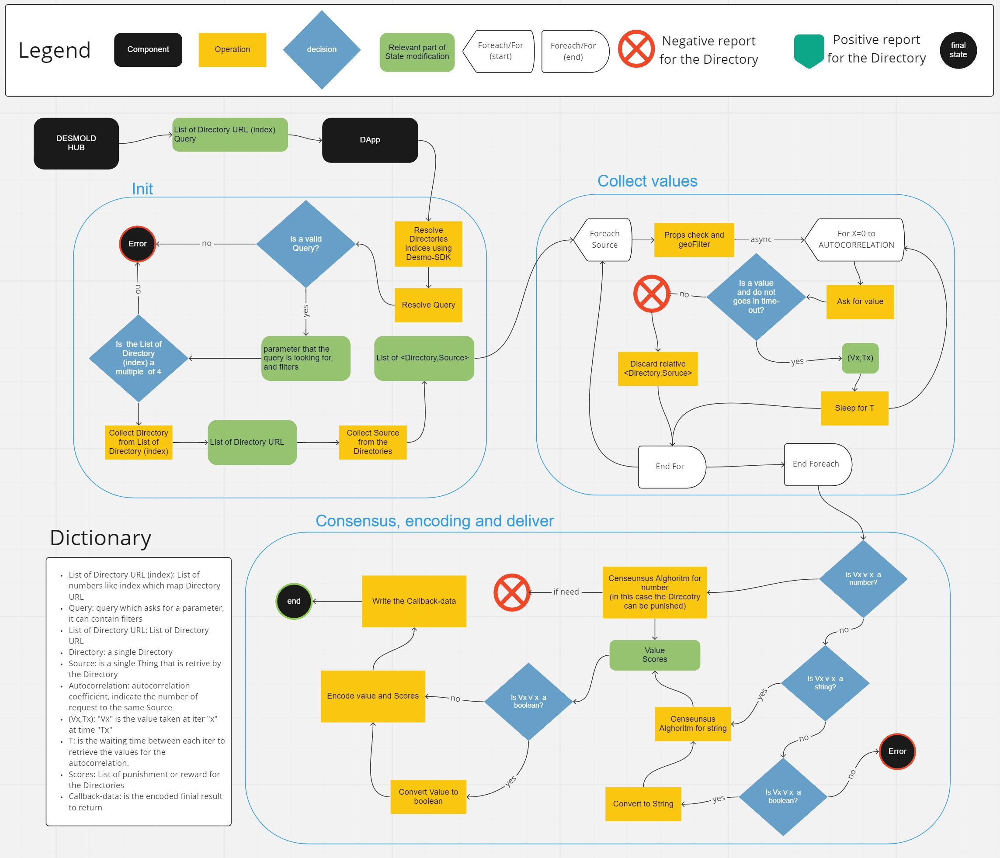

# DESMO-LD Oracle DApp

**Overview** 

Desmo-LD will leverage on iExec distributed cloud computing features to deploy its
off-chain Oracle components. The Oracle DApp is an IExec decentralized application
written in node-js (Typescript) which acts as the backend of Desmo-LD iExecDOracle. In
particular, it is in charge of parsing and translating the on-chain oracle requests,
collecting the results from the selected TDDs, reaching a consensus on the Web
Thing response, and returning the response. Thanks to iExec secure environment
facilities, enabled Web Things can be operated within a secure enclave where
credentials can be shared without any risk of information leaking.

**System Architecture**

**Github Repository**
[Desmo-DApp](https://github.com/vaimee/desmo-dapp)

**Contents**
1. [WAM for TDs example management](WAM.md)
2. [Linksmart Directory for Directories example](LinksmartDirectory.md)
3. [DApp](docs/IexecDAPP.md)
    1. [Consensus algorithm for TDs result](docs/algorithm.md)
    2. [Econding result](docs/encoding.md)
    3. [UML](docs/uml.md)

# Behavior
Consider a DESMO-LD request as a data query for IoT data, followed by a list of Directories.
The DApp lives in the iExec worker-pool that will run several instances of the DApp with the same arguments.
The arguments are the DESMO-LD request: a JSON-path query and the list of Directories that can be used from the DApp in order to resolve the query.
Each instance of the DApp is isolated from the others and will do the same: 
1. Parse the query
2. Collect the Directories
3. Collect the TDs for each valid Directories
4. Collect the values from the valid TDs, several times following a time distribution. If a TD returns a not valid value it will be discarded and considered not a valid TD.
5. Running a consensus algorithm on all the values and trying to find out the best value. As the best value is considered a real reading from one of these TDs that is the more likely near to other values that are been read at the same time from the other DApp instances.
6. Reward or punish, by assigning a score, the Directories that were not valid or that return not valid TDs.
7. Return the list of scores and the best value found.

At that point, the behavior of the DApp ends, and the iExec worker-poll will collect all the results and will run another consensus algorithm on all the DApp instances results. Finally, when the worker-poll achieves the consensus the result is forwarded to the Smart Contract.

# LOCAL TEST

The DApp can be run as a TypeScript application, without using docker and without on-chain components.
It has some tests that can be run on your local machine, each test deals with a part of the DApp.
One of them aims to simulate a DESMO-LD request to the DApp testing the whole application.
In order to run that test, it is needed to setup and run all the services that simulate a use-case environment.

**SETUP**

First of all, we need to install and setup WAM (WoT Application Manager), that will be used to create and run TDs.
1. `cd ./example-tds`
2. `npm install`
3. `npm run build`
4. `npm start`

WAM is build and running, with some TD alredy created and ready to use.
You can find other information about WAM [here](WAM.md).

Now, we need to download, setup and run the Directory.
In that test we use *linksmart* repository to create and lunch some Directories.
In order to use the *linksmart*, we have to install *GO*.
Download and install GO from [go.dev](https://go.dev/dl/).

After you test that GO is working on your local machine, you have to download, setup, and run the *linksmart* repository:
1. `cd ./linksmart-directory` 
2. `./downloadRepo.sh`
3. `cd ./directoryManager` 
4. `npm install` 
5. `npm start` 

The next step is to install the global npm dependency that the DApp needs.
1. `cd ./DApp` 
2. `npm install -g ts-node typescript '@types/node'`

Now, you have all the services that are required to run the use-case test.

**RUN TEST**
Here we will run the use-case test, considering all the services previously configured not running.
It is recommended to stop all the services if they are running because some of them will start in a different way than that used in the configuration.

As a first service, we need to start WAM (like in the configuration).
1. `cd ./example-tds`
2. `npm start`

Then we will start several Directories (*buildAndRunMultiple.sh*) and we will register some TDs in each of them (*setupMultiple.sh*).
Warning the first script (*buildAndRunMultiple.sh*), will open a visible terminal for each Directory (as default 10 Directories).
1. `cd ./linksmart-directory`
2. `./buildAndRunMultiple.sh`
3. `./setupMultiple.sh` 

Finally, we can start the test, which will start a DApp with a case query and the list of the Directories that are running on your local machine.
1. `cd ./DApp` 
2. `ts-node tests/runTests.ts usecase`

Wait for the end of the test, and you should see the results of the request.

In the following pages, you can find some details about the important part of the DApp and the other services that it uses.